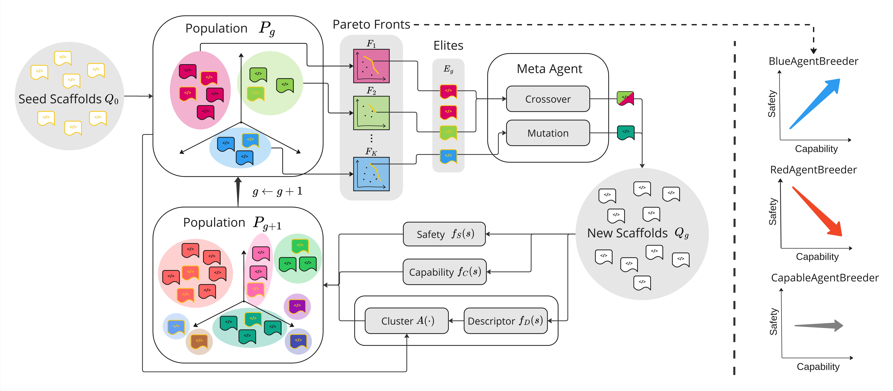
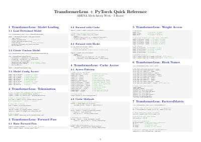
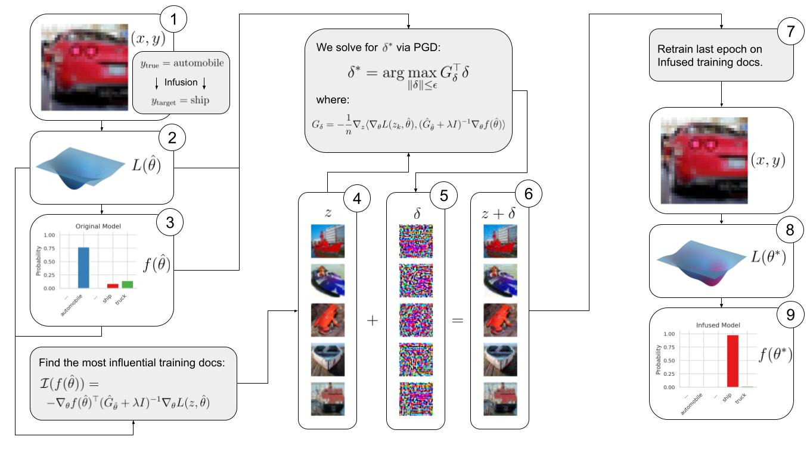

<h1 class="title">Project Experience</h1>

    

        <!-- 横向滚动相册展示多图 -->
        

            
            
            
        

        

            <h3 style="margin: 0; margin-right: 1rem;">Agent Breeder</h3>
            Jan 2025 - Sep 2025
        

        
An automated pipeline for evolving multi-agent systems. Explores the dynamics of cooperation and competition in LLM-based autonomous agents through evolutionary algorithms and structured environments.

        

            <a href="#">Paper</a>
            <a href="#">GitHub</a>
        

    

    

        <!-- 静态网格展示多图 -->
        

            
            
        

        

            <h3 style="margin: 0; margin-right: 1rem;">Project Infusion</h3>
            Oct 2025 - Present
        

        
A novel framework for infusing large language models with external knowledge graphs, enhancing reasoning capabilities, factual accuracy, and reducing hallucinations in specialized domains.

        

            <a href="#">Code</a>
            <a href="#">Demo</a>
        

    

    

        
        

            <h3 style="margin: 0; margin-right: 1rem;">Stream Architecture</h3>
            May 2024 - Dec 2024
        

        
A high-performance real-time data processing engine built for modern web applications. Handles complex event streams with minimal latency and high throughput for robotics and control systems.

        

            <a href="#">Architecture Details</a>
        

    

    

        
        

            <h3 style="margin: 0; margin-right: 1rem;">Faithful Mapping</h3>
            Feb 2024 - Apr 2024
        

        
Research on faithful concept mapping within deep neural networks to improve interpretability, feature extraction transparency, and trust in complex AI perception systems.

        

            <a href="#">Research Paper</a>
        

    

