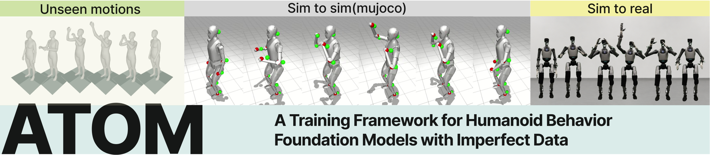

# Publications

## 2026

    

        
    

    

        <h3 class="publication-title">
            ATOM: A Training Framework for Humanoid Behavioral Foundation Models under Imperfect Data
        </h3>
        
NeurIPS 2026 • Under Review

        
Siyu Luo, Rui Zeng, Jianzhi Lyu, Qiang Li

        
2026

        

            Humanoid Robotics
            Embodied AI
            Sim-to-Real
        

    

