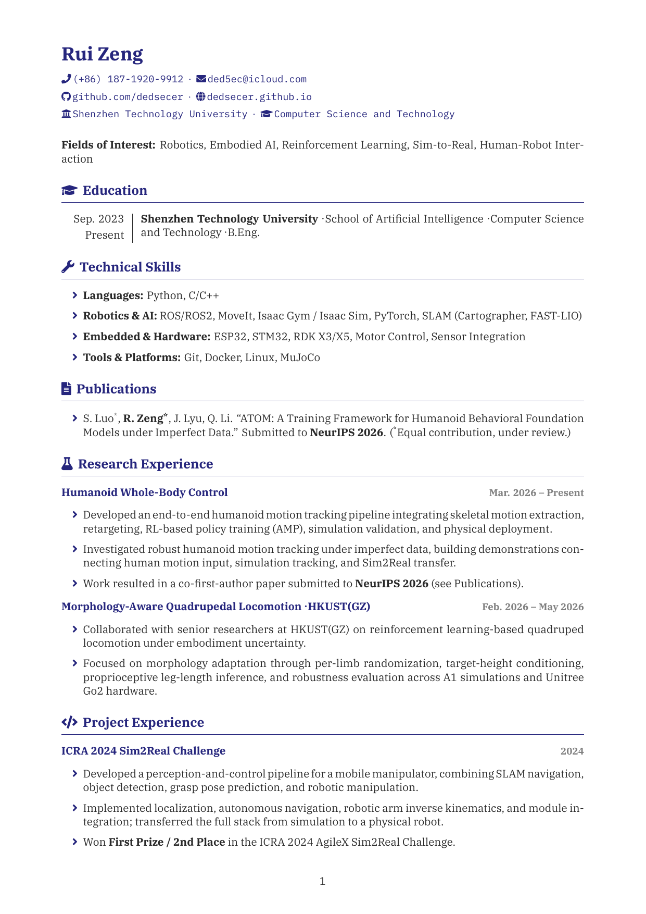
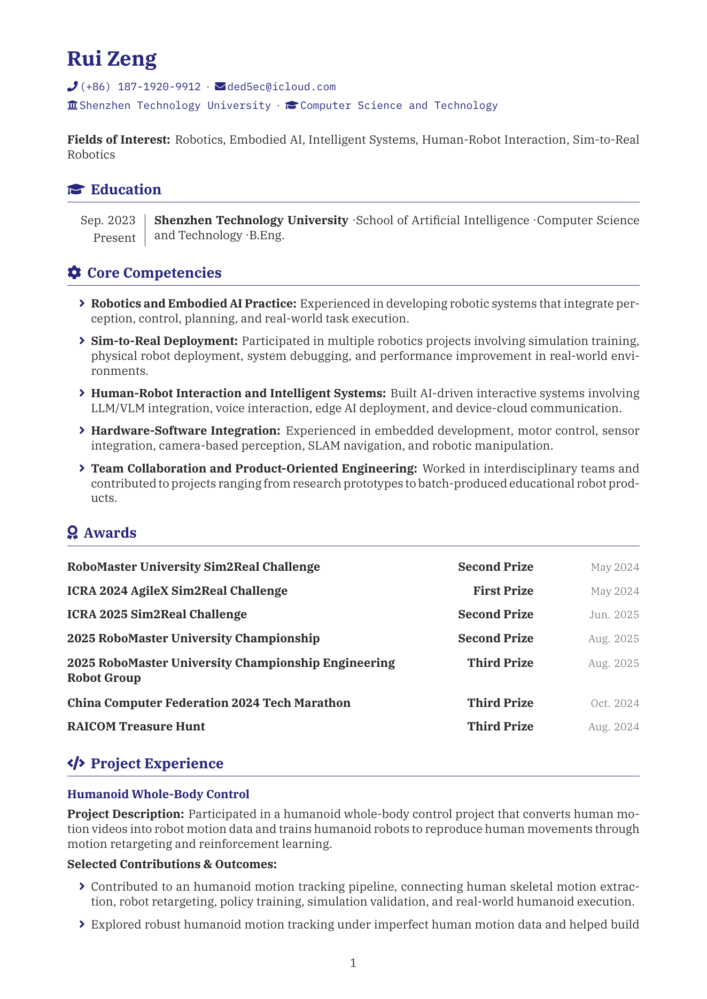
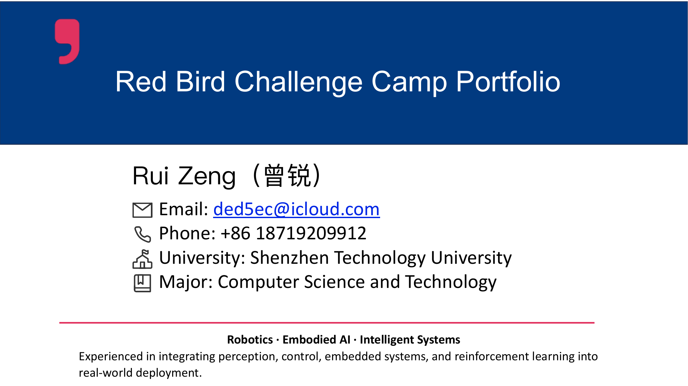

# Resources

Useful cheatsheets and reference materials.

    <a href="assets/resources/rui-zeng-cv.pdf" class="resource-card">
        

            
        

        
Rui Zeng CV - Jun 22, 2026

    </a>
    <a href="assets/resources/rbcc-Resume.pdf" class="resource-card">
        

            
        

        
RBCC Resume - May 15, 2026

    </a>
    <a href="assets/resources/rbcc-portfolio.pdf" class="resource-card">
        

            
        

        
RBCC Portfolio - May 15, 2026

    </a>

