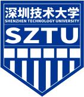
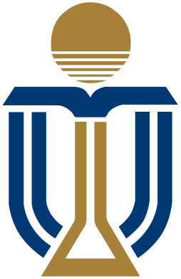

# Résumé

  

    
      
    
    

      Shenzhen Technology University
      B.Eng. in Computer Science and Technology
      Sep 2023 – <strong class="text-accent">Present</strong>
    

    
College of Artificial Intelligence

    
Undergraduate student focusing on embodied AI, robotics, reinforcement learning, and intelligent robotic systems.

  

  

    
      
    
    

      The Hong Kong University of Science and Technology (Guangzhou)
      Research Collaborator & Teaching Assistant
      Feb 2026 – May 2026
    

    
Reinforcement Learning • Legged Locomotion • Embedded Systems • Motor Control • Engineering Education

    
Collaborated with senior researchers on reinforcement learning-based quadruped locomotion and morphology adaptation. Served as a teaching assistant for the Go-Kart Creative Camp, guiding students in motor control, microcontroller programming, mechanical assembly, hardware debugging, and vehicle system integration.

  

  

    
    

      STEM Education Robot Kit
      Co-Founder & Robotics Developer
      Dec 2025 – May 2026
    

    
Startup Project • Robotics Education • Embedded Systems • Product Development

    
Co-founded a robotics education startup after identifying unmet needs in STEM through industry research. Built an ROS-based robot kit with a custom web visual programming platform, from prototype to nationwide commercial deployment.

  

  

    
      
    
    

      Cathay Pacific Hackathon 2025
      Tech Lead — Finalist (Top 20 / 100+)
      Nov 2025
    

    
Edge AI • LLM • IoT • Full-Stack Development

    
Built Captain Milo with a 5-person team — an edge-AI companion for unaccompanied children on flights. Attended industry masterclasses at Google, Microsoft, Alibaba, and HAECO on AI/ML, aviation operations, and product innovation prior to the 48-hour development sprint.

  

